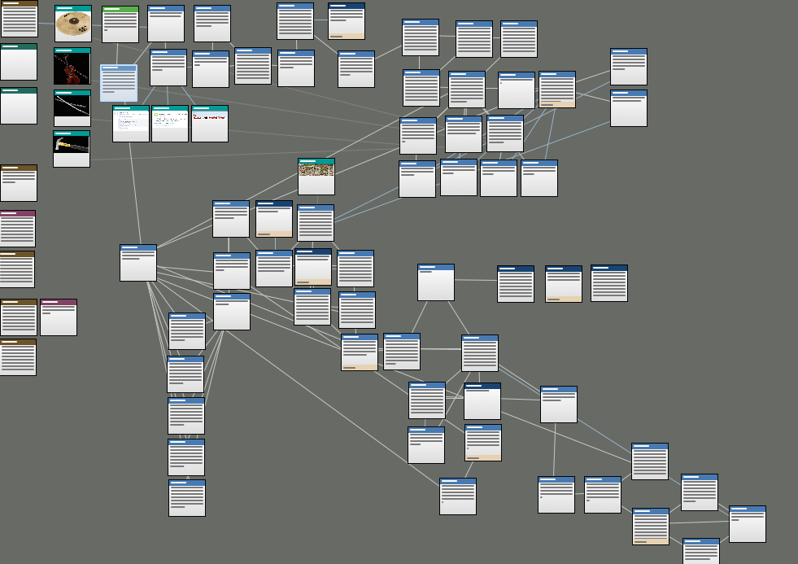
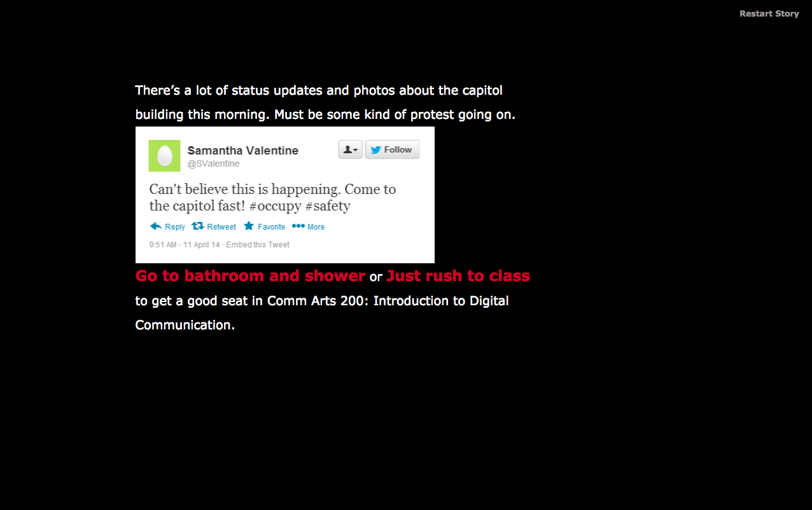

# twine-wiscalert

Warning: The narrative may contain strong language. 

This is a Zombie Apocalypse theme interactive fiction powered by Twine. The story was developed for a class project <a href="http://courses.jamesjbrownjr.net/177_spring2014">ENG 177: Literature and Videogames</a> with Professor Brown. I don't own nor have the rights for the music and images that were used in the game. The stylesheet was based on <a href="http://aliendovecote.com/uploads/twine/LD25/CYBERQUEEN.html">Cyberqueen</a>. Attributions to the authors and media content were cited at the end of the game.

<b> Turn up the volume for the best experience! <a href="https://github.com/rickixie/twine-wiscalert"> * </a></b>

The Twine Map

Game Screenshot

